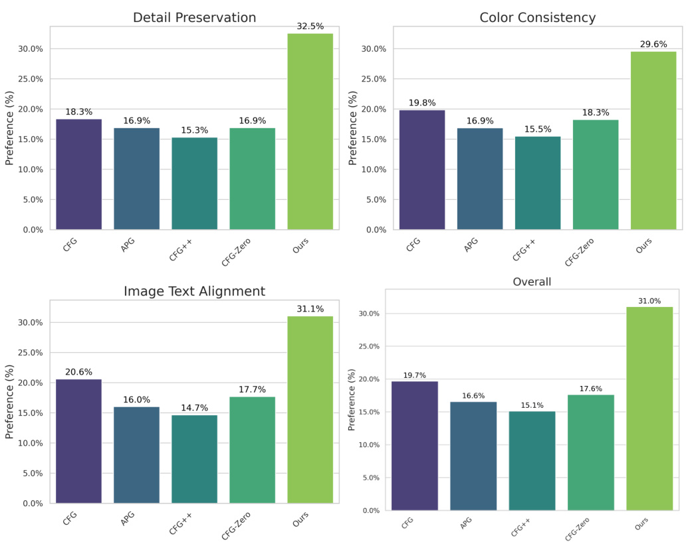
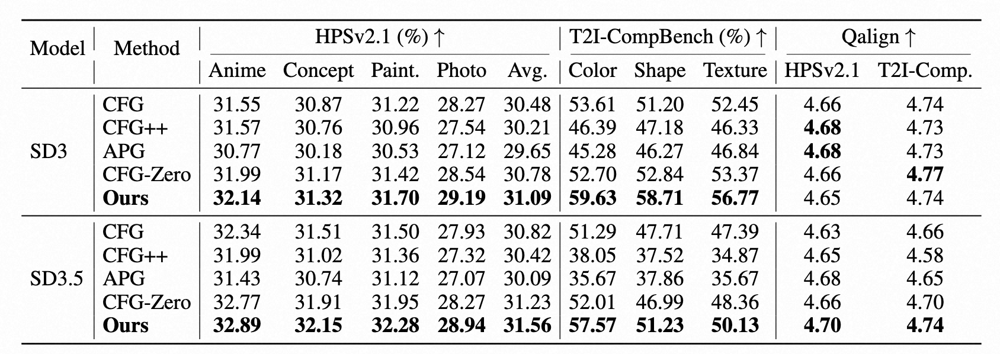
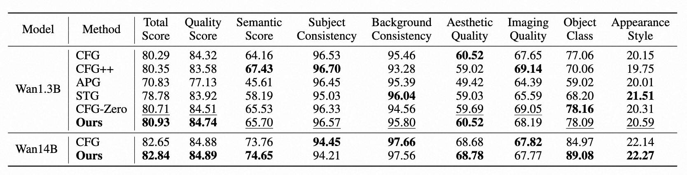

# S²-Guidance: Stochastic Self-Guidance for Training-Free Enhancement of Diffusion Models

  <!-- 作者行 -->
  Chubin Chen1,2,
  Jiashu Zhu2,
  Xiaokun Feng2,3,
  Nisha Huang1
   
  Meiqi Wu2,3,
  Fangyuan Mao2,
  Jiahong Wu2,‡,
  Xiangxiang Chu2,
  Xiu Li1,†
    
  <!-- 机构行 -->
  1Tsinghua University &nbsp;&nbsp;&nbsp;
  2AMAP, Alibaba Group &nbsp;&nbsp;&nbsp;
  3CASIA
   
  †Corresponding author. &nbsp;&nbsp;&nbsp;
  ‡Project lead.

<!-- 徽章 (Badges) 部分 (已修正，移除了下划线) -->

  
  &nbsp;&nbsp;&nbsp;
  
  &nbsp;&nbsp;&nbsp;

<!-- Teaser Image -->

## 🔥 Updates
- **[2025/08]** Our paper is available on [arXiv](https://arxiv.org/abs/2312.01323) and the [project page](https://s2guidance.github.io/) is live!
- **[Coming Soon]** Code will be released. 

## 📣 Overview

  

We propose **S²-Guidance**, a novel method that leverages stochastic block-dropping during the forward process to construct sub-networks, effectively guiding the model away from potential low-quality predictions and toward high-quality outputs. Extensive qualitative and quantitative experiments on text-to-image and text-to-video generation tasks demonstrate that **S²-Guidance** delivers superior performance, consistently surpassing CFG and other advanced guidance strategies.

## 🎉 Results
Here are some examples comparing the results from standard Classifier-free Guidance (CFG) with our **S²-Guidance**. Our method consistently produces higher-fidelity and more coherent results.

### Text-to-Image Generation

**Prompt:** "The bold dramatic strokes of the painter's brush created a stunning abstract masterpiece a work of emotional depth and intensity."
| CFG | Ours (S²-Guidance) |
|:--------------:|:------------------:|
|  |  |

---

**Prompt:** "A floating castle above the clouds, with 'S² Guidance Is All You Need' swirling in the mist."
| CFG | Ours (S²-Guidance) |
|:--------------:|:------------------:|
|  |  |

---

**Prompt:** "A woman is holding a bouquet of balloons and celebrating a birthday."
| CFG | Ours (S²-Guidance) |
|:--------------:|:------------------:|
|  |  |

---

**Prompt:** "A red book and an ivory sheep."
| CFG | Ours (S²-Guidance) |
|:--------------:|:------------------:|
|  |  |

---

**Prompt:** "A cat sitting besides a rocket on a planet with a lot of cactuses."
| CFG | Ours (S²-Guidance) |
|:--------------:|:------------------:|
|  |  |

---

**Prompt:** "A woman sitting under an umbrella in the middle of a restaurant."
| CFG | Ours (S²-Guidance) |
|:--------------:|:------------------:|
|  |  |

### Text-to-Video Generation

**Prompt:** "A breathtaking close-up of a woman frozen in time as golden threads of light weave around her face, creating dynamic flowing patterns of energy amidst glowing particles."
<table border="0" style="width: 100%; text-align: center; margin-top: 20px;">
  <tr>
    <td style="text-align: center;">
      <b>CFG</b>
       
      <video src="https://github.com/user-attachments/assets/ca181aed-1889-4b90-a885-ef429dc861e0" width="100%" controls autoplay loop muted playsinline alt="CFG Video 4"></video>
    </td>
    <td style="text-align: center;">
      <b>Ours (S²-Guidance)</b>
       
      <video src="https://github.com/user-attachments/assets/b14c92be-860a-4596-91f3-ed8ce4e0e9cd" width="100%" controls autoplay loop muted playsinline alt="Ours Video 4"></video>
    </td>
  </tr>
</table>

---

**Prompt:** "An astronaut flying in space, zoom out."
<table border="0" style="width: 100%; text-align: center; margin-top: 20px;">
  <tr>
    <td style="text-align: center;">
      <b>CFG</b>
       
      <video src="https://github.com/user-attachments/assets/255444a3-3130-4747-913c-fc9ad3e11ae8" width="100%" controls autoplay loop muted playsinline alt="CFG Video 3"></video>
    </td>
    <td style="text-align: center;">
      <b>Ours (S²-Guidance)</b>
       
      <video src="https://github.com/user-attachments/assets/067fba6c-c244-4f6a-a55f-5ba785ad6264" width="100%" controls autoplay loop muted playsinline alt="Ours Video 3"></video>
    </td>
  </tr>
</table>

---

**Prompt:** "A car accelerating to gain speed."
<table border="0" style="width: 100%; text-align: center; margin-top: 20px;">
  <tr>
    <td style="text-align: center;">
      <b>CFG</b>
       
      <video src="https://github.com/user-attachments/assets/8b1903e6-d45c-4411-81f7-4d93a008c427" width="100%" controls autoplay loop muted playsinline alt="CFG Video 2"></video>
    </td>
    <td style="text-align: center;">
      <b>Ours (S²-Guidance)</b>
       
      <video src="https://github.com/user-attachments/assets/0886e3a1-e60e-49b3-9b7a-8b300820892d" width="100%" controls autoplay loop muted playsinline alt="Ours Video 2"></video>
    </td>
  </tr>
</table>

---

**Prompt:** "A parking meter and a truck."
<table border="0" style="width: 100%; text-align: center; margin-top: 20px;">
  <tr>
    <td style="text-align: center;">
      <b>CFG</b>
       
      <video src="https://github.com/user-attachments/assets/8a6faf1a-5641-4467-89b3-ac5c7b6e716d" width="100%" controls autoplay loop muted playsinline alt="CFG Video 1"></video>
    </td>
    <td style="text-align: center;">
      <b>Ours (S²-Guidance)</b>
       
      <video src="https://github.com/user-attachments/assets/73e453a1-7470-4d2a-8d10-fab8b5a3a0ba" width="100%" controls autoplay loop muted playsinline alt="Ours Video 1"></video>
    </td>
  </tr>
</table>

### User Study

### Quantitative Results

#### HPSV2.1 & T2I-ComBench

#### VBench

## 🙏 Acknowledgements
This work is built upon many amazing open-source projects. We would like to thank the developers of [Diffusers](https://github.com/huggingface/diffusers), [PyTorch](https://pytorch.org/), and other related libraries for their contributions to the community.

## 📜 Citation
If you find our work useful for your research, please consider citing our paper.
