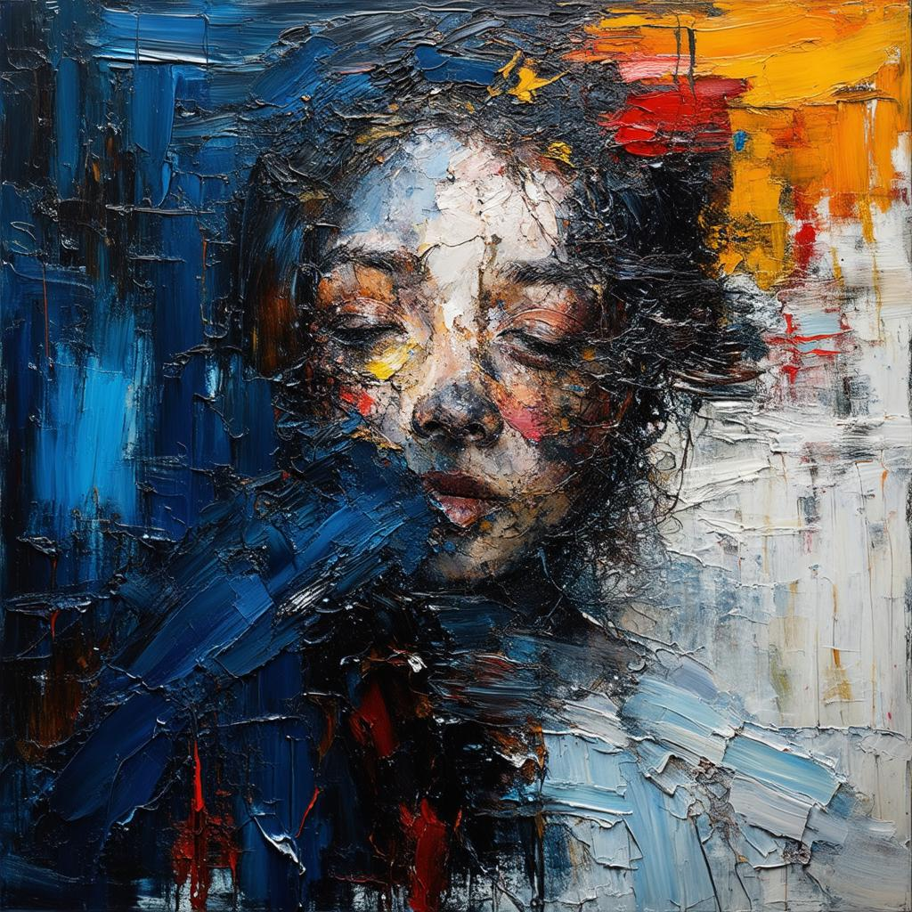
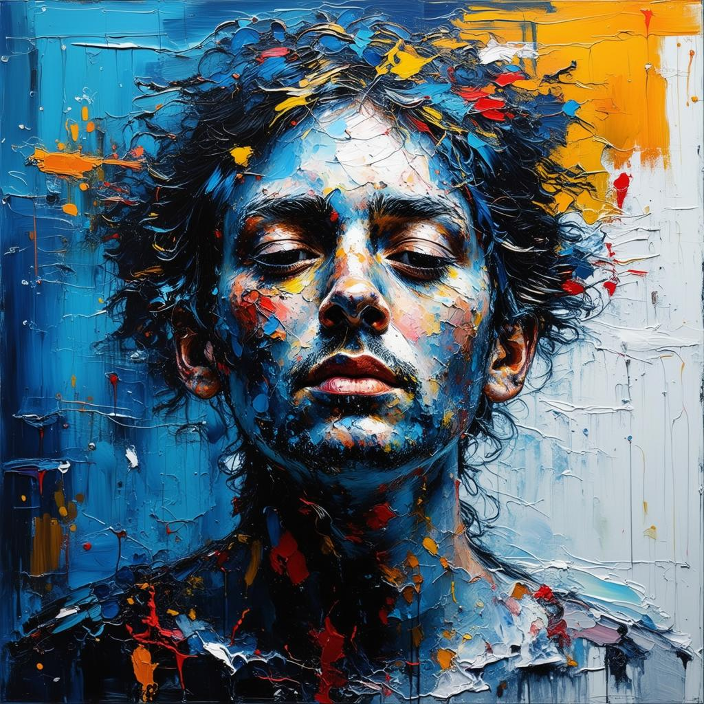
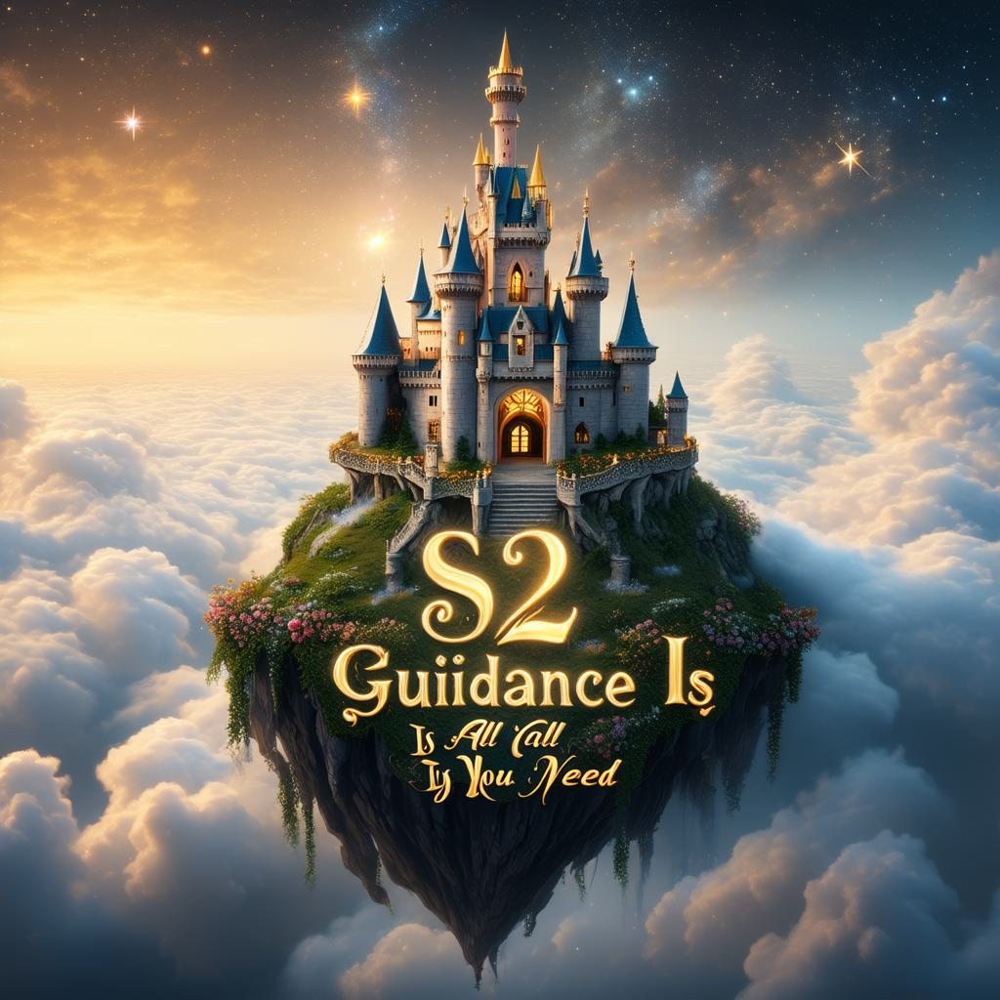
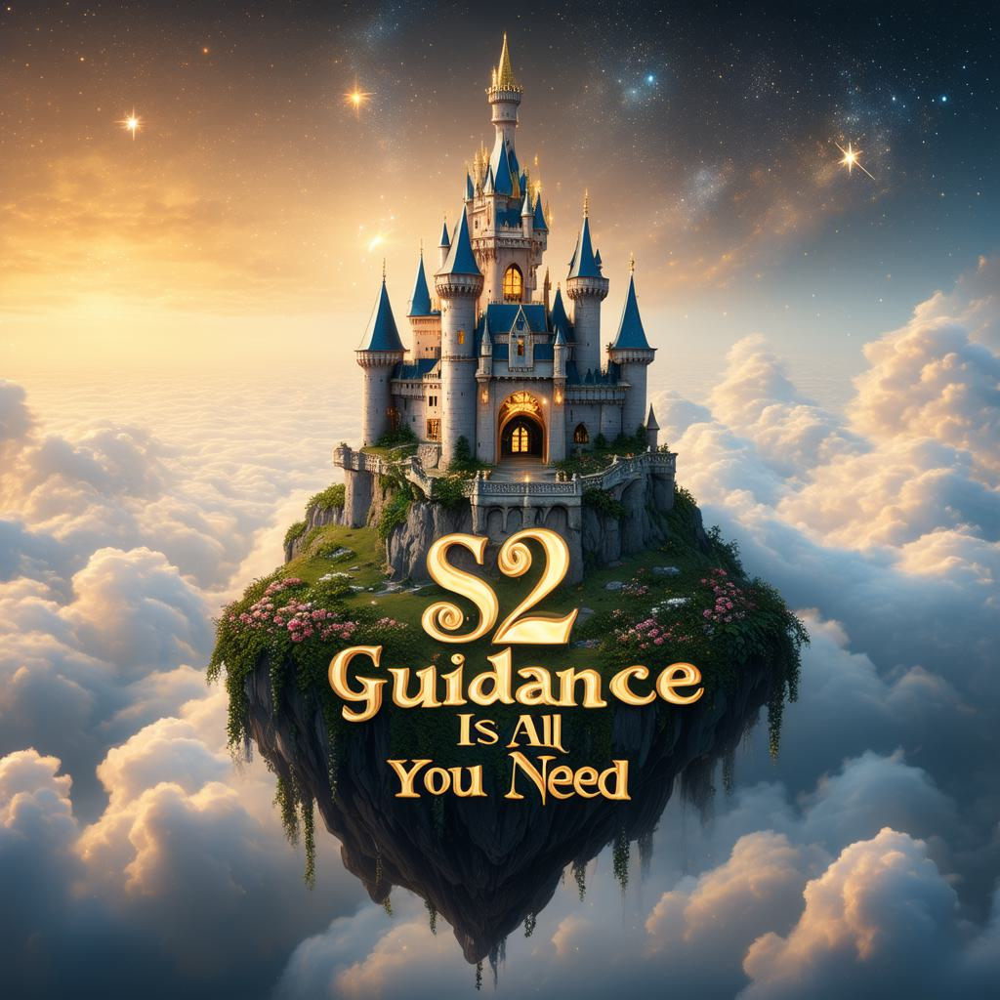
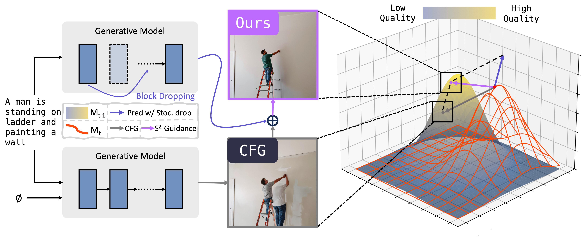

# S²-Guidance: Stochastic Self-Guidance for Training-Free Enhancement of Diffusion Models

  <!-- 作者行 -->
  Chubin Chen1,2,*,
  Jiashu Zhu2,
  Xiaokun Feng2,3,
  Nisha Huang1
   
  Meiqi Wu2,3,
  Fangyuan Mao2,
  Jiahong Wu2,‡,
  Xiangxiang Chu2,
  Xiu Li1,†
    
  <!-- 机构行 -->
  1Tsinghua University &nbsp;&nbsp;&nbsp;
  2AMAP, Alibaba Group &nbsp;&nbsp;&nbsp;
  3CASIA
   
  †Corresponding author. &nbsp;&nbsp;&nbsp;
  ‡Project lead.

<!-- Teaser Image -->

<!-- 徽章 (Badges) -->

  
  &nbsp;&nbsp;&nbsp;
  
  &nbsp;&nbsp;&nbsp;

## 🔥 Updates
- **[2025/08]** Our paper is available on [arXiv](https://arxiv.org/abs/2312.01323) and the [project page](https://s2guidance.github.io/) is live!
- **[Coming Soon]** Code and models will be released. Stay tuned!

## 🎨 Showcase
Here are some examples comparing the results from standard Classifier-Free Guidance (CFG) with our **S²-Guidance**. Our method consistently produces higher-fidelity and more coherent results.

### Text-to-Image Generation

**Prompt:** "The bold dramatic strokes of the painter's brush created a stunning abstract masterpiece a work of emotional depth and intensity."
| CFG | Ours (S²-Guidance) |
|:--------------:|:------------------:|
|  |  |

---

**Prompt:** "A floating castle above the clouds, with 'S² Guidance Is All You Need' swirling in the mist."
| CFG | Ours (S²-Guidance) |
|:--------------:|:------------------:|
|  |  |

---

**Prompt:** "A woman is holding a bouquet of balloons and celebrating a birthday."
| CFG | Ours (S²-Guidance) |
|:--------------:|:------------------:|
|  |  |

---

**Prompt:** "A red book and an ivory sheep."
| CFG | Ours (S²-Guidance) |
|:--------------:|:------------------:|
|  |  |

---

**Prompt:** "A cat sitting besides a rocket on a planet with a lot of cactuses."
| CFG | Ours (S²-Guidance) |
|:--------------:|:------------------:|
|  |  |

---

**Prompt:** "A woman sitting under an umbrella in the middle of a restaurant."
| CFG | Ours (S²-Guidance) |
|:--------------:|:------------------:|
|  |  |

### Text-to-Video Generation

**Prompt:** "A breathtaking close-up of a woman frozen in time as golden threads of light weave around her face, creating dynamic flowing patterns of energy amidst glowing particles."
| CFG | Ours (S²-Guidance) |
|:--------------:|:------------------:|
| <video src="assets/baseline_video1.mp4" autoplay loop muted playsinline alt="CFG Video 1"></video> | <video src="assets/ours_video1.mp4" autoplay loop muted playsinline alt="Ours Video 1"></video> |

---

**Prompt:** "An astronaut flying in space, zoom out."
| CFG | Ours (S²-Guidance) |
|:--------------:|:------------------:|
| <video src="assets/baseline_video2.mp4" autoplay loop muted playsinline alt="CFG Video 2"></video> | <video src="assets/ours_video2.mp4" autoplay loop muted playsinline alt="Ours Video 2"></video> |

---

**Prompt:** "A car accelerating to gain speed."
| CFG | Ours (S²-Guidance) |
|:--------------:|:------------------:|
| <video src="assets/baseline_video3.mp4" autoplay loop muted playsinline alt="CFG Video 3"></video> | <video src="assets/ours_video3.mp4" autoplay loop muted playsinline alt="Ours Video 3"></video> |

---

**Prompt:** "A parking meter and a truck."
| CFG | Ours (S²-Guidance) |
|:--------------:|:------------------:|
| <video src="assets/baseline_video4.mp4" autoplay loop muted playsinline alt="CFG Video 4"></video> | <video src="assets/ours_video4.mp4" autoplay loop muted playsinline alt="Ours Video 4"></video> |

## 📖 Abstract
> Classifier-free Guidance (CFG) is a widely used technique in modern diffusion models for enhancing sample quality and prompt adherence. However, through an empirical analysis on Gaussian mixture modeling with a closed-form solution, we observe a discrepancy between the suboptimal results produced by CFG and the ground truth. The model's excessive reliance on these suboptimal predictions often leads to semantic incoherence and low-quality outputs. To address this issue, we first empirically demonstrate that the model's suboptimal predictions can be effectively refined using sub-networks of the model itself. Building on this insight, we propose **S²-Guidance**, a novel method that leverages stochastic block-dropping during the forward process to construct sub-networks, effectively guiding the model away from potential low-quality predictions and toward high-quality outputs. Extensive qualitative and quantitative experiments on text-to-image and text-to-video generation tasks demonstrate that **S²-Guidance** delivers superior performance, consistently surpassing CFG and other advanced guidance strategies.

## ⚙️ Method
Our method, S²-Guidance, operates by injecting noise into intermediate feature maps of the diffusion model's U-Net and then using the model's own denoising capabilities to predict a "cleaner" version of those features. The difference between the original and the cleaner features serves as a guidance signal, steering the overall generation process towards more refined results. The diagram below illustrates the core mechanism.

  

## 🙏 Acknowledgements
This work is built upon many amazing open-source projects. We would like to thank the developers of [Diffusers](https://github.com/huggingface/diffusers), [PyTorch](https://pytorch.org/), and other related libraries for their contributions to the community.

## 📜 Citation
If you find our work useful for your research, please consider citing our paper.
